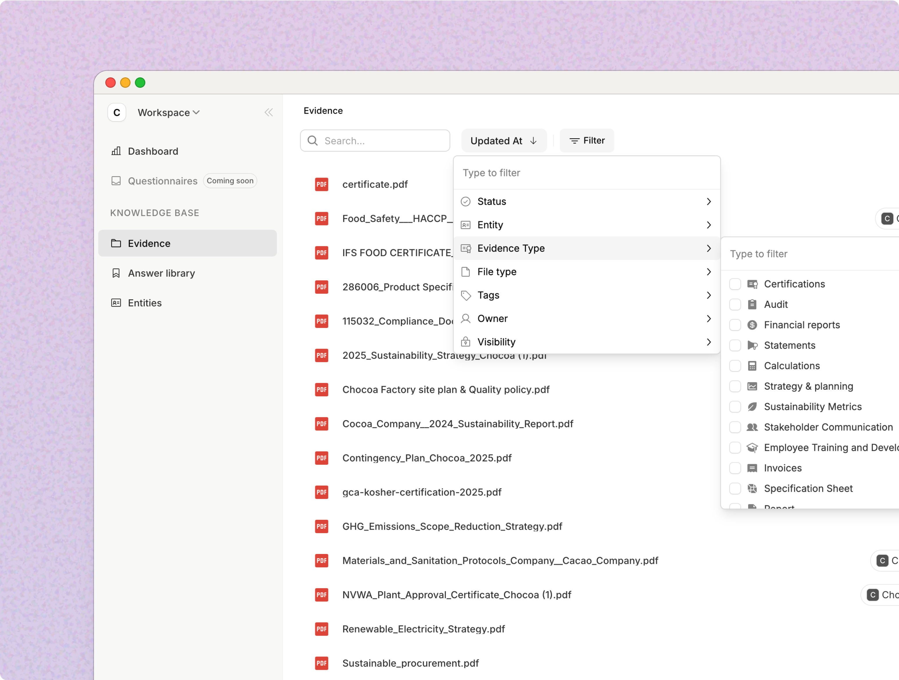
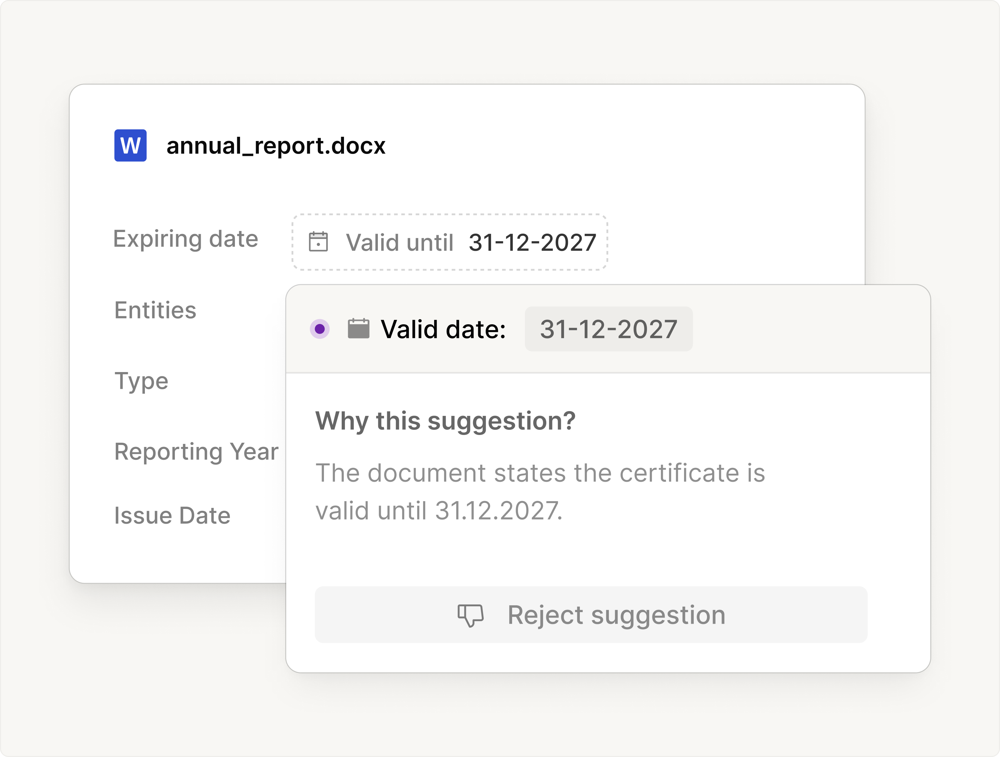
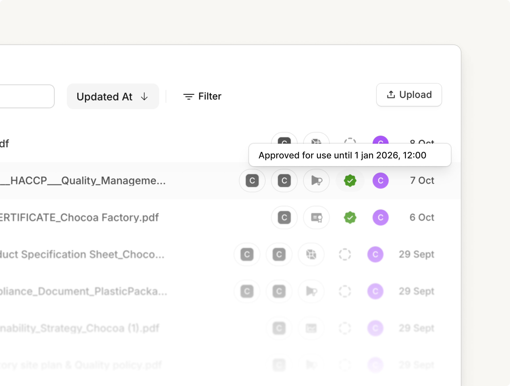
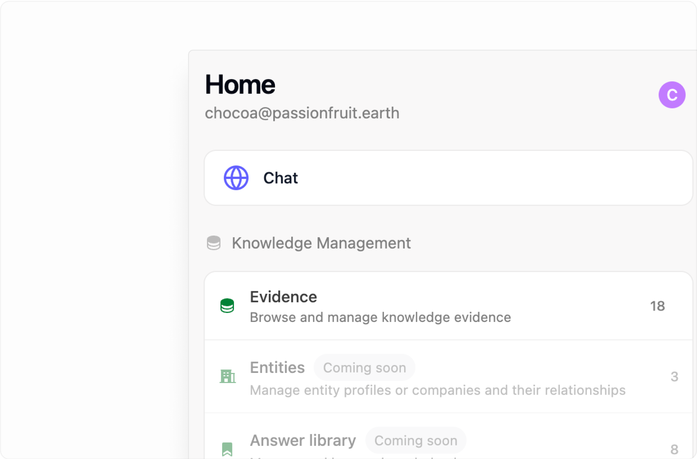
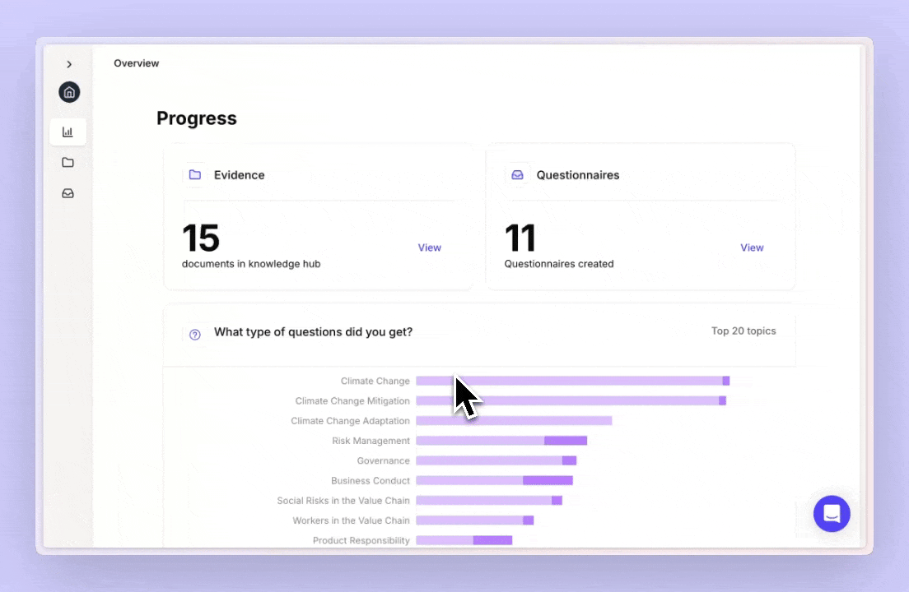

## February 9, 2025

#### Find company information

Company information — addresses, VAT numbers, codes, and other details — lives in one place and is organized by entity. Each entity has its own set, automatically filled and always up to date. When you search, Passionfruit finds the right information for the entity you’re working with. Answers and evidence stay filtered to that entity so you don’t mix information between companies or subsidiaries.

  <video
    autoPlay
    muted
    loop
    playsInline
    className="w-full h-full"
    src="/videos/changelog/REL26-company-info-search.mp4"
  ></video>

#### Switch to another company or subsidiary

When you need to work with a different company or subsidiary, switch in one click. Your answers and evidence stay scoped to the one you choose, so you never mix information between them.

  <video
    autoPlay
    muted
    loop
    playsInline
    className="w-full h-full"
    src="/videos/changelog/REL26-quick-entity-switcher.mp4"
  ></video>

#### Other improvements

- **Copy from PDFs** — Copy and paste text from PDFs straight into Passionfruit; selection and copy work reliably and stay visible.
- **Answer library** — Saved answers keep your exact wording. When you save an answer to the library, we now store the sources that were actually cited. Tables can’t be saved in answers, so the library stays clean and consistent.
- **Search** — Search is better at finding the right information on the first try. When you filter by entities only, evidence and answers are included by default so results stay relevant. Source counts show how many files and answers were used (and show “None” when zero). When nothing is found, you still see what was searched.
- **Copy and feedback** — Copy answers with clear visual feedback. Tables in answers support copy and citations. The feedback modal shows which question you’re commenting on.

#### Bug fixes and polish

- **Copy from PDFs** — Copy and paste text from evidence PDFs straight into Passionfruit; selection and copy work reliably, stay visible, and no longer misalign. The viewer scrolls correctly to citations and works with large files.
- Answer review: copy answer works again; confidence scores display correctly.
- Modals and layout: improved spacing and sizing; long answers no longer overflow the page.
- Feedback submission and a few styling and display tweaks across the app.

---

## January 2025

#### Bulk edit

In the main application, edit multiple evidence, entities, or answers at once. Change one field while the rest stay locked, or update many items in a single go.

  <video
    autoPlay
    muted
    loop
    playsInline
    className="w-full h-full"
    src="/videos/changelog/REL26-bulk-edit.mp4"
  ></video>

---

## November 27, 2025

#### Filter on entities

Instantly limit your search context to everything that is relevant for one or more entities. When you choose specific entities, only the evidence and answers linked to those entities will be considered, keeping your results focused and precise.

  <video
    autoPlay
    muted
    loop
    playsInline
    className="w-full h-full"
    src="/videos/changelog/REL25-search-config.mp4"
  ></video>

#### Manual selecting

Select specific sources to include in your search context. Choose individual evidence files or answer library items to narrow your search, ensuring answers come only from the sources you specify.

  <video
    autoPlay
    muted
    loop
    playsInline
    className="w-full h-full"
    src="/videos/changelog/REL25-search-config-select-individual-sources.mp4"
  ></video>

[Read more about filtering your search context](/docs/fill-questionnaires/search-context)

---

## November 19, 2025

The Passionfruit Agent just got a major upgrade. It understands your questions better, searches with deeper context, and brings the right evidence forward faster.

#### Answer multiple questions at once

You can now ask multiple related questions at once, and Passionfruit will answer each one, citing sources for every response.

  <video
    autoPlay
    muted
    loop
    playsInline
    className="w-full h-full"
    src="/videos/REL24-follow-up-questions.mp4"
  ></video>

<Info>Tip: For best results, try to ask no more than 5 questions at once.</Info>
#### Smarter reasoning

Passionfruit now better understands what you mean and brings the right context together. Answers are clearer and more consistent, explain how they were reached, and always link back to their sources.

  

#### Review mode

See the source behind every answer. Open Review to check context quickly, or switch to Review mode and use split view to compare sources next to answers.

  

    
  

  

    
  

#### Split view

Drag the extension sidebar wider to expand split view, giving you more room to review sources next to answers.

  

[Read more about Review mode](/docs/fill-questionnaires/review-answers)

#### Chat history

Start new chats and quickly preview your other conversations. Everything stays in context with sources and follow‑ups, so you can pick up where you left off.

  

<Info>
  Tip: Use Chat history when you’re switching context, for example, moving from
  one entity to another.
</Info>

[Read more about Chat history](/docs/fill-questionnaires/manage-chats)

## October 27, 2025

See suggested answers with evidence directly inside supplier and customer portals.

#### Chrome and Edge extensions

Generate and verify answers directly in portals like Microsoft Forms, ImpactBuying, TraceOne, SAP Ariba, and Google Forms, without leaving the page.

  

Available today on Chrome and Microsoft Edge. Get access for you and your team via the [Install Browser Extensions](/docs/installation/install) guide.

---

## October 8, 2025

Stay in flow with a focused interface, accurate auto-tagging, and quicker performance across the app and add-ins.

#### Renewed interface

A refreshed, cleaner look that’s easier to read. Evidence search is simpler with clearer filters, so you can narrow results and find the right file fast. Fewer distractions, quicker decisions.

#### Manage knowledge without leaving your document

Work from the app you’re in. No need to switch to the main app. Manage evidence, answers, and entities right in the add‑in so you never break your workflow. Everything stays in sync across Passionfruit.

  <video
    autoPlay
    muted
    loop
    playsInline
    className="w-full h-full"
    src="/videos/REL22-evidence-upload-file.mp4"
  ></video>

#### Evidence organized for you

Evidence is automatically organized on upload with accurate auto‑tagging and context awareness. Related entities are detected to keep evidence and answers neatly grouped. This reduces manual tagging and keeps knowledge structured as it grows.

#### Stay ahead of expirations

Expiry and review dates are picked up automatically when you upload. We surface upcoming renewals so you can review on time and keep information current. No manual tracking needed.

#### Other improvements

- **Polished navigation**: Moving between pages feels more consistent and predictable.
- **Faster uploads and navigation**: Files upload quicker and pages open faster so you spend less time waiting.
- **UI refinements**: Subtle visual tweaks for a cleaner, more cohesive look.

## July 31, 2025

#### Review Excel Function

You can now review the answers generated from Excel functions by viewing them directly in the chat interface. This makes it easier to verify answers and looking through the evidence.

  <video
    autoPlay
    muted
    loop
    playsInline
    className="w-full h-full"
    src="/videos/excel-functions-review.mp4"
  ></video>

--- #### PDF Search We've completely redesigned the PDF review experience with
improved interactions and a cleaner, more intuitive design. You can now easily
search through evidence within PDFs, making research and document analysis
significantly faster. 

---

#### Manage knowledge from Add-in

The home page has been redesigned to provide better organization and quick access to your evidence. Reviewing your answer library, managing your knowledge base, and accessing recent conversations is now more streamlined and intuitive.

---

#### Other improvements

- **Conversation History:** Enhanced conversation management and history tracking
- **UI Updates** - Various interface refinements and visual improvements across the application for better usability and accessibility
- **Performance Optimizations** - Faster loading times and smoother interactions throughout the platform

---

## June 8, 2025

#### Chat improvements and PDF viewer

We've fixed critical login issues that were blocking Excel users from accessing Passionfruit, and added the ability to view PDF evidence directly within the Excel add-in. You can now see the source documents that inform AI answers without switching between applications.

**Enhanced messaging interface**

- The conversation view has been redesigned for cleaner presentation and better source referencing
- Improved context handling means answers now reference your actual company name instead of generic placeholders

**Enhanced reasoning**

- Even when the AI can't find a specific answer, it now provides clear explanations of what it searched and why certain information might be missing
- Clickable source citations take you directly to the relevant PDF sections and evidence locations

---

## June 1, 2025

#### Excel functions

Transform any Excel cell into an AI-powered questionnaire assistant with native Passionfruit functions. Use `=PASSIONFRUIT.ASK("your question")` directly in spreadsheet cells to automatically populate answers from your knowledge base and answer library.

**Bulk processing**

- Apply functions across multiple rows to answer entire sections of questionnaires at once

---

## May 11, 2025

#### Answer Library

Build institutional knowledge with every questionnaire you complete. The Answer Library automatically captures and organizes your best responses, making them instantly reusable for future compliance requests.

**Key features**

- Smart answer matching: When you ask a new question, Passionfruit first checks if you've answered something similar before
- Quality control: Review, edit, and approve answers before they become part of your reusable library
- Team collaboration: Share approved answers across your organization
- Usage analytics: See which answers are most frequently reused and track their success rates

---

## February 24, 2025

#### Automate answering directly in Word and Excel

Customers send you questions via email, Word, PDF, or Excel, and you need to respond in the same format. Now you can.

We already made this possible in Excel, and now our new Word Add-in brings the same experience to more tools you use every day. No switching between platforms, no copy-pasting.

**Features**

- Track the source of every answer instantly
- Save responses to your library for future use
- Send back questionnaires in the exact format your customers require
- Work seamlessly within Word, Outlook, or Excel

_PDF and online portals are coming soon._

---

## February 13, 2025

#### Shared Workspaces

Now, you and your colleagues—even across different teams or entities—can work together in a single Passionfruit environment. Set roles, assign tasks or sections of questionnaires, and manage approvals in a way that fits your internal workflows and organization.

---

## October 13, 2024

#### Auto-tag sources

Leverage auto-tag to automatically label your data source files, enhance knowledge organization and improve document search.

---

## September 10, 2024

#### Export your questionnaire to Excel

Easily export your questionnaires to Excel, keeping all your answers, scores, and details in one place. Review or share them with just a few clicks!

---

## August 20, 2024

#### Enhanced suggestion reviews and Excel export

**Answer with confidence**

- Get a confidence score for each answer, showing how closely it matches the question based on key terms
- Instantly see the document or paragraph it's sourced from
- Feel assured your response is on point

**Better manage your questionnaires**

- Add tags for status, topic, requesting party, responsible department, and more
- Easier categorization and management of your questionnaires

**Improvements and bug fixes**

- Optimized questionnaire importing - 30% improved accuracy on importing from Excel and PDF
- Increased speed and stability - Faster loading times and enhanced stability for a smoother experience

## Stay Updated

Subscribe to our newsletter to get notified about new releases and features.

- [Subscribe to Updates](mailto:updates@example.com)
