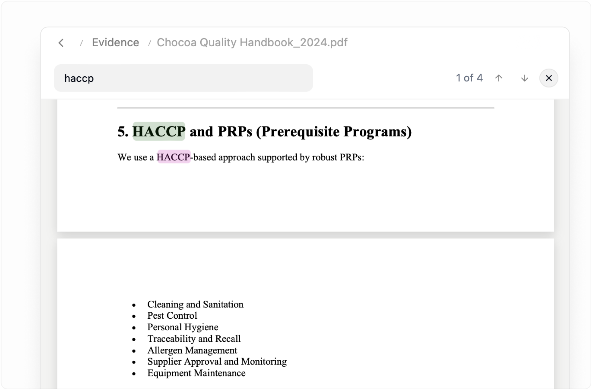
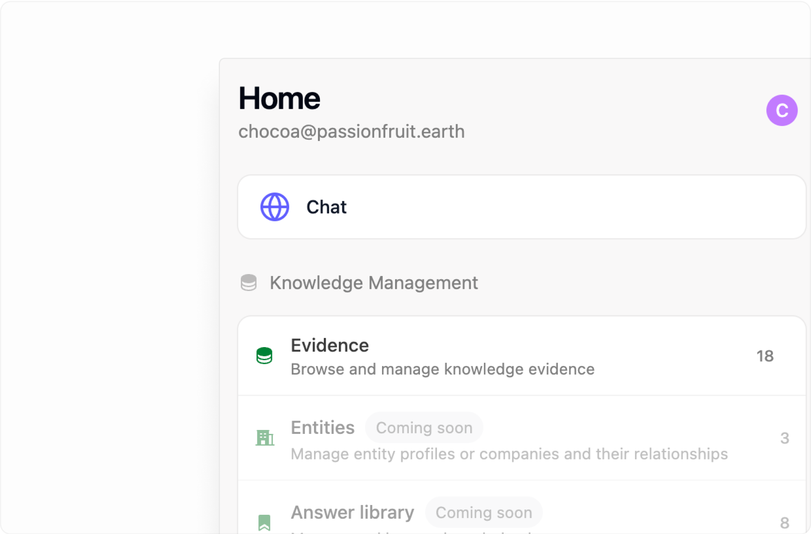
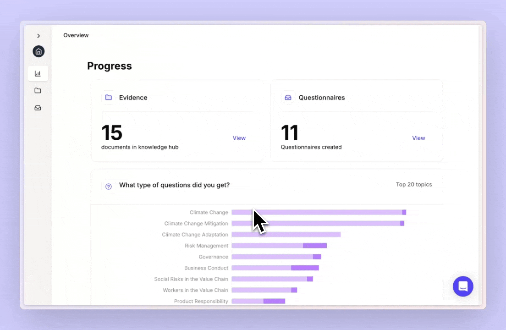

#### July 31, 2025

  Review Excel Function

You can now review the answers generated from Excel functions by viewing them directly in the chat interface. This makes it easier to verify answers and looking through the evidence.

  <video
    autoPlay
    muted
    loop
    playsInline
    className="h-fit aspect-video rounded-md overflow-hidden"
    src="/videos/excel-functions-review.mp4"
  ></video>

---

PDF Search

We've completely redesigned the PDF review experience with improved interactions and a cleaner, more intuitive design. You can now easily search through evidence within PDFs, making research and document analysis significantly faster.

---

 Manage knowledge from Add-in

The home page has been redesigned to provide better organization and quick access to your evidence. Reviewing your answer library, managing your knowledge base, and accessing recent conversations is now more streamlined and intuitive.

---

 Other improvements 

- **Conversation History:** Enhanced conversation management and history tracking
- **UI Updates** - Various interface refinements and visual improvements across the application for better usability and accessibility
- **Performance Optimizations** - Faster loading times and smoother interactions throughout the platform

---

## June 8, 2025

  Chat improvements and PDF viewer

We've fixed critical login issues that were blocking Excel users from accessing Passionfruit, and added the ability to view PDF evidence directly within the Excel add-in. You can now see the source documents that inform AI answers without switching between applications.

**Enhanced messaging interface**

- The conversation view has been redesigned for cleaner presentation and better source referencing
- Improved context handling means answers now reference your actual company name instead of generic placeholders

**Enhanced reasoning**

- Even when the AI can't find a specific answer, it now provides clear explanations of what it searched and why certain information might be missing
- Clickable source citations take you directly to the relevant PDF sections and evidence locations

---

## June 1, 2025

  Excel functions

Transform any Excel cell into an AI-powered questionnaire assistant with native Passionfruit functions. Use `=PASSIONFRUIT.ASK("your question")` directly in spreadsheet cells to automatically populate answers from your knowledge base and answer library.

**Bulk processing**

- Apply functions across multiple rows to answer entire sections of questionnaires at once

---

## May 11, 2025

  Answer Library

Build institutional knowledge with every questionnaire you complete. The Answer Library automatically captures and organizes your best responses, making them instantly reusable for future compliance requests.

**Key features**

- Smart answer matching: When you ask a new question, Passionfruit first checks if you've answered something similar before
- Quality control: Review, edit, and approve answers before they become part of your reusable library
- Team collaboration: Share approved answers across your organization
- Usage analytics: See which answers are most frequently reused and track their success rates

---

## February 24, 2025

  Automate answering directly in Word and Excel

Customers send you questions via email, Word, PDF, or Excel, and you need to respond in the same format. Now you can.

We already made this possible in Excel, and now our new Word Add-in brings the same experience to more tools you use every day. No switching between platforms, no copy-pasting.

**Features**

- Track the source of every answer instantly
- Save responses to your library for future use
- Send back questionnaires in the exact format your customers require
- Work seamlessly within Word, Outlook, or Excel

_PDF and online portals are coming soon._

---

## February 13, 2025

  Shared Workspaces

Now, you and your colleagues—even across different teams or entities—can work together in a single Passionfruit environment. Set roles, assign tasks or sections of questionnaires, and manage approvals in a way that fits your internal workflows and organization.

---

## October 13, 2024

  Auto-tag sources

Leverage auto-tag to automatically label your data source files, enhance knowledge organization and improve document search.

---

## September 10, 2024

  Export your questionnaire to Excel

Easily export your questionnaires to Excel, keeping all your answers, scores, and details in one place. Review or share them with just a few clicks!

---

## August 20, 2024

  Enhanced suggestion reviews and Excel export

**Answer with confidence**

- Get a confidence score for each answer, showing how closely it matches the question based on key terms
- Instantly see the document or paragraph it's sourced from
- Feel assured your response is on point

**Better manage your questionnaires**

- Add tags for status, topic, requesting party, responsible department, and more
- Easier categorization and management of your questionnaires

**Improvements and bug fixes**

- Optimized questionnaire importing - 30% improved accuracy on importing from Excel and PDF
- Increased speed and stability - Faster loading times and enhanced stability for a smoother experience

## Stay Updated

Subscribe to our newsletter to get notified about new releases and features.

- [Subscribe to Updates](mailto:updates@example.com)
